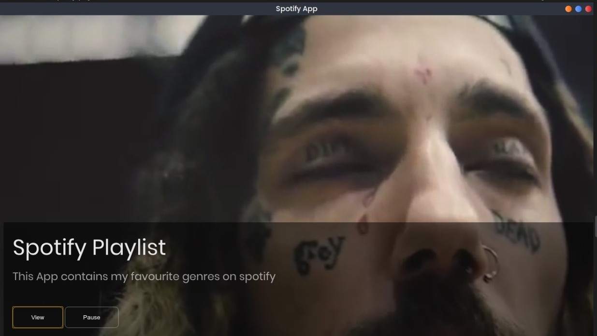

# Spotify-Playlist
Electron Forge App

## To get started:

clone repo  
npm install   
npm start or electron-forge start 

To use electron forge commands make sure you have it installed:  
npm install -g electron-forge 

## To build :

electron-forge package  
electron-forge make  
electron-forge publish  

## Dependencies: 

Bootstrap  
Electron Squirrel  
Electron Compile  

### View :
[View Live App](https://nkosi-tauro.github.io/Spotify-Playlist/src/index.html)

